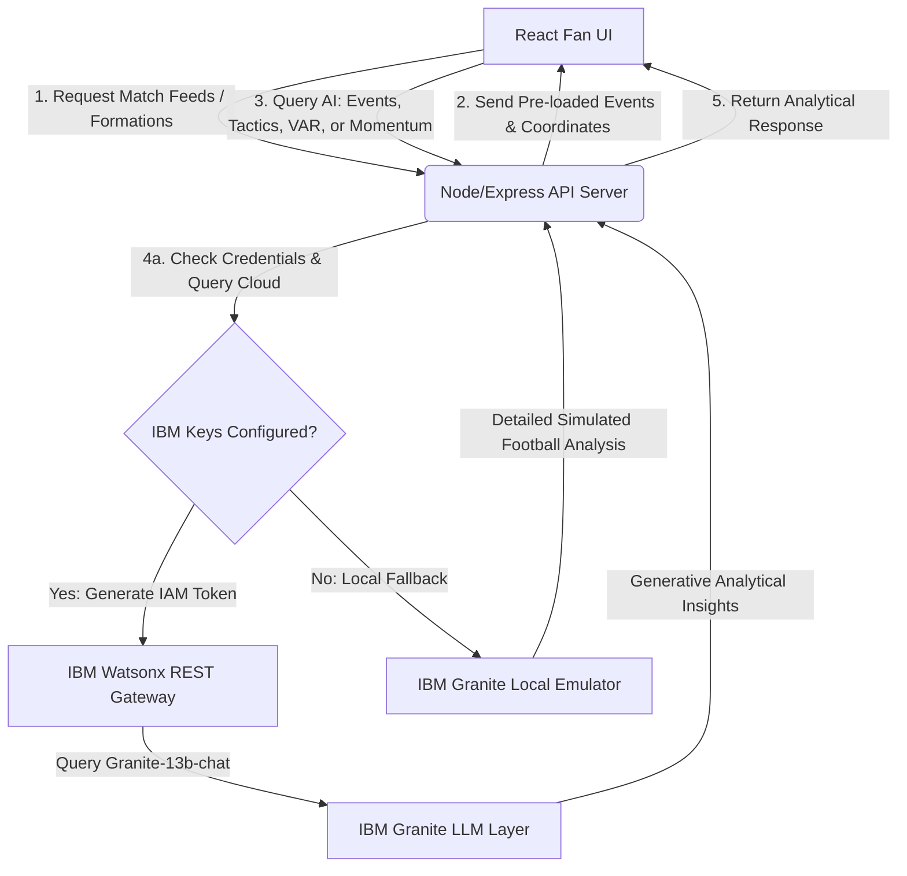

# MatchMind AI ⚽🧠
### *AI-Inside-The-Match: Football Tactical and Rule Explainer*
**A Submission for the IBM SkillsBuild AI Builders Challenge**

---

## 👥 Team & Submission Information
- **Project Name**: MatchMind AI
- **Theme**: AI Inside the Match
- **Team Member**: Deshraj Verma
- **Target AI Platform**: IBM watsonx.ai (IBM Granite Model Layer)

---

## 📋 Table of Contents
1. [The Problem](#-the-problem)
2. [The Solution](#-the-solution)
3. [🎯 Challenge Fit & Theme Alignment](#-challenge-fit--theme-alignment)
4. [🤖 IBM Technology & AI Integration](#-ibm-technology--ai-integration)
5. [🏗️ Application Architecture](#-application-architecture)
6. [🚀 Key Features](#-key-features)
7. [🛠️ Tech Stack](#-tech-stack)
8. [💻 How to Run Locally](#-how-to-run-locally)
9. [🎥 Demo Video & Screenshots](#-demo-video--screenshots)
10. [🔮 Future Improvements](#-future-improvements)

---

## 🔍 The Problem
Modern football analytics are incredibly advanced, yet they remain locked behind complex coordinate charts, heatmaps, and paywalled databases. Concurrently:
- **Tactical Ambiguity**: Casual fans see substitutions and formation changes but rarely understand *why* they occurred or *how* they shifted the spaces on the pitch.
- **VAR Trust Deficit**: Contentious referee decisions (offside checks, handball penalties) leave fans feeling frustrated and confused due to lack of familiarity with official **IFAB Laws**.
- **Data Overload**: Linear statistics (possession %, shots) fail to paint the picture of *momentum* and how specific in-play events trigger psychological and physical control surges.

---

## 💡 The Solution
MatchMind AI serves as the ultimate "AI Inside the Match" companion, integrating four core analytical modules:

1. **Match Event Explainer**: A chronological match timeline. Fans can click any incident (goals, cards, substitutions) to read a Granite-generated breakdown of *how* the play materialized, complete with a custom prompt box to query the AI directly.
2. **Tactical Shift Analyzer**: A digital magnetic board displaying starting lineups. It isolates key strategic adjustments made by managers during the match, with Granite breaking down shape changes (e.g. transitioning to a back-3 or low block pivot).
3. **VAR Trust Companion**: A dedicated officiating room listing video reviews. It maps the referee's call to the official **IFAB Law Reference** and uses Granite to explain the officiating criteria (such as *natural silhouette* or *clear & obvious thresholds*), rebuilding fan trust.
4. **Momentum Insight Dashboard**: A dynamic line chart powered by **Recharts** plotting team control indices (0-100) minute-by-minute. Fans can select momentum window surges and request a Granite analysis explaining why the game's tide turned.

---

## 🎯 Challenge Fit & Theme Alignment
MatchMind AI directly fulfills the **"AI Inside the Match"** theme by embedding AI where the fan experience usually fractures. 

Instead of treating football as static lines of numbers, MatchMind AI uses IBM Granite to translate raw coordinate data, rulebook law indexes, and timeline logs into readable sports insights. It shifts the fan's role from a passive spectator to an active tactical analyst, democratizing sports intelligence and making officiating transparent.

---

## 🤖 IBM Technology & AI Integration
MatchMind AI interfaces directly with **IBM watsonx.ai** to run generative text inference.

- **Model Used**: `ibm/granite-13b-chat-v2` / `ibm/granite-3-8b-instruct`.
- **API Connection**: The backend Express server authenticates with IBM Cloud IAM OAuth tokens to securely make low-latency POST calls to the Watsonx text generation endpoint:
  ```
  https://us-south.ml.cloud.ibm.com/ml/v1/text/generation?version=2023-05-29
  ```
- **IBM Granite Emulator / Mock Mode**: To ensure a seamless local evaluation experience when API keys are absent, the application features a dynamic offline simulator. When active credentials are not found in the environment files, the app automatically switches to **"IBM Granite Emulator / Mock Mode"** and displays clear header badges in the UI. This mode reads the requested prompt context and simulates detailed Granite tactical breakdowns based on actual match settings.

---

## 🏗️ Application Architecture

The diagram below represents the system architecture and data pipelines:



---

## 🚀 Key Features
- **Premium Dark Aesthetics**: Styled with neon green grass-pitch grid highlights, custom scrollbars, and sleek glassmorphic card overlays.
- **Dynamic Whiteboard**: Displays players as numbered nodes based on actual coordinates, visualizing team structures (e.g., 4-3-3 vs 4-2-3-1).
- **Interactive Graphs**: Live charting of performance momentum indicators using **Recharts**.
- **Real-world Match Feeds**: Pre-populated with classic tactical matches:
  - 🏆 *FIFA World Cup Final 2022*: Argentina vs France
  - 👑 *UEFA Champions League Final 2024*: Real Madrid vs Dortmund
  - 🔴 *Premier League Decider 2024*: Man City vs Arsenal
- **Custom Chat Prompts**: Allows fans to ask follow-up questions about VAR rulings or custom play segments.

---

## 🛠️ Tech Stack
- **Frontend**:
  - React (Vite)
  - Tailwind CSS v4 (native lightning compiler)
  - Recharts (responsive charting)
  - Lucide React (vector dashboard icons)
- **Backend**:
  - Node.js + Express
  - Axios (IBM Cloud token generation & generation calls)
  - Dotenv (secure environment variable abstraction)
  - Cors (development resource sharing)

---

## 💻 How to Run Locally

### Prerequisites
- Node.js (v18.0.0 or higher)
- npm (v9.0.0 or higher)

### Step 1: Configure the Backend
1. Open a terminal and navigate to the backend folder:
   ```bash
   cd backend
   ```
2. Install the server dependencies:
   ```bash
   npm install
   ```
3. Set up your environment variables. Copy `.env.example` to `.env`:
   ```bash
   cp .env.example .env
   ```
4. *Optional*: Open `.env` and fill in your IBM watsonx.ai credentials:
   ```env
   WATSONX_API_KEY=your_ibm_cloud_api_key
   WATSONX_PROJECT_ID=your_watsonx_project_id
   ```
   *(If left blank, the app runs using the local mock AI engine automatically)*
5. Start the API server:
   ```bash
   npm start
   ```
   The server will start listening at `http://localhost:5000`. You can test it by going to `http://localhost:5000/api/health`.

### Step 2: Configure the Frontend
1. Open a second terminal window and navigate to the frontend folder:
   ```bash
   cd frontend
   ```
2. Install the client packages:
   ```bash
   npm install
   ```
3. Start the Vite development server:
   ```bash
   npm run dev
   ```
4. Open your browser and navigate to `http://localhost:5173`.

---

## 🌐 Deployment Instructions

MatchMind AI is designed to be easily deployed as a decoupled full-stack application.

### 1. Deployed Backend (Render / Railway)
To deploy the Node.js Express server to a cloud provider:
1. Create a new Web Service on **Render** or **Railway** and link your GitHub repository.
2. Set the **Root Directory** setting to `backend`.
3. Set the **Build Command** to `npm install`.
4. Set the **Start Command** to `npm start`.
5. Configure the following **Environment Variables**:
   - `PORT`: (Managed automatically by the platform, defaults to 5000 or dynamic port).
   - `ALLOWED_ORIGINS`: Comma-separated list of allowed origins (e.g. `https://matchmind-ai.vercel.app`).
   - `WATSONX_API_KEY`: Your IBM Cloud API key (for Granite generation).
   - `WATSONX_PROJECT_ID`: Your watsonx.ai Project ID.
   - `WATSONX_URL`: `https://us-south.ml.cloud.ibm.com`.
   - `WATSONX_MODEL_ID`: `ibm/granite-13b-chat-v2`.

### 2. Deployed Frontend (Vercel)
To deploy the React client:
1. Import your repository into **Vercel**.
2. Set the **Root Directory** option to `frontend`.
3. Vercel will auto-detect **Vite** as the framework and configure the build settings (`npm run build`, `dist` output).
4. Configure the following **Environment Variables**:
   - `VITE_API_BASE_URL`: The URL of your deployed Express backend (e.g. `https://matchmind-ai-backend.onrender.com/api`).
5. Click **Deploy**. Vercel will build and serve your application over SSL.

---

## 🎥 Demo Video & Screenshots

- **Live Application Link**: [MatchMind AI Live Demo](https://matchmind-ai.vercel.app-placeholder) *(Replace with your actual deployment link)*
- **Demo Video Walkthrough**: [Watch the Video Demonstration](https://example.com/demo-video-placeholder) *(Replace with your recording link)*

### Premium Landing Page


### Tactical whiteboards & Momentum Graphs
*(Vite Dev Server live rendering preview)*

---

## 🔮 Future Improvements
1. **Live Feed Integrations**: Connect with Opta, StatsBomb, or WyScout API feeds to enable real-time analysis of active in-progress matches.
2. **IBM Watson Text-to-Speech**: Integrate voice synthesized narrations of tactical shifts and VAR checks for visually impaired fans or audio-only listening.
3. **Multiplayer Fan Debates**: Implement fan discussion channels where the IBM Granite model acts as an impartial referee, referencing IFAB rules to resolve disputes.
4. **Predictive Analytics**: Utilize Watson Machine Learning to run in-play forecasts predicting substitutions and tactical countermeasures before they happen.
